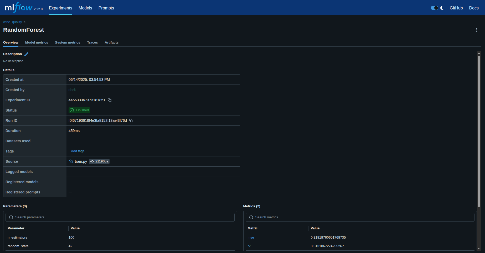
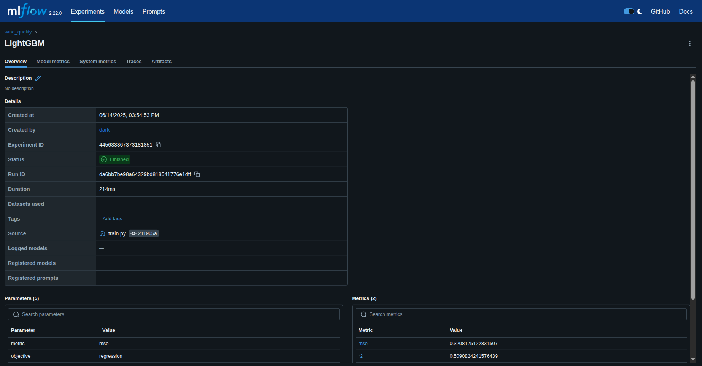
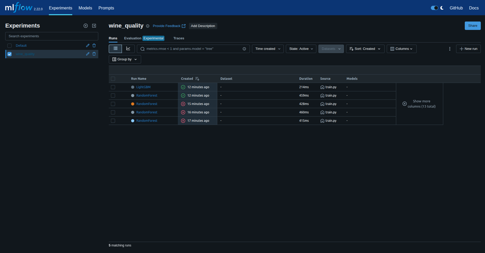

# ITMO_Final_Project

# Wine Quality Prediction

## Data
Dataset: UCI Wine Quality (red).  
Download: `dvc pull` (requires configured MinIO remote).  
File location: `data/raw/winequality-red.csv`

## Experiments
We use MLflow for experiment tracking. To run experiments:

1. Start MLflow server:
```bash
mlflow server --host 0.0.0.0 --port 5000
```

2. Install dependencies:
```bash
pip install -r requirements.txt
```

3. Run experiments:
```bash
python src/experiments/train.py
```

4. View results in MLflow UI (http://localhost:5000)

### Models and Parameters
We compare two models with grid search over multiple parameters:

#### RandomForest Regressor
- n_estimators: [50, 100, 200]
- max_depth: [5, 10, 15, None]
- min_samples_split: [2, 5, 10]
- min_samples_leaf: [1, 2, 4]

#### LightGBM
- num_leaves: [15, 31, 63]
- learning_rate: [0.01, 0.05, 0.1]
- feature_fraction: [0.7, 0.8, 0.9]
- bagging_fraction: [0.7, 0.8, 0.9]
- bagging_freq: [1, 3, 5]

### Metrics
- MSE (Mean Squared Error)
- R2 Score

### Results
The best model and its parameters are automatically logged to MLflow. You can view:
- Parameter importance
- Learning curves
- Model performance comparison
- Best model selection

## Experiment Results

The experiments were run using MLflow for tracking. The results are as follows:

- **RandomForest**: MSE: 0.3182, R2: 0.5131
- **LightGBM**: MSE: 0.3208, R2: 0.5091

### Screenshots

Below are screenshots of the MLflow UI showing the experiment runs:

- **RandomForest Run**:
  

- **LightGBM Run**:
  

- **Experiment Overview**:
  

